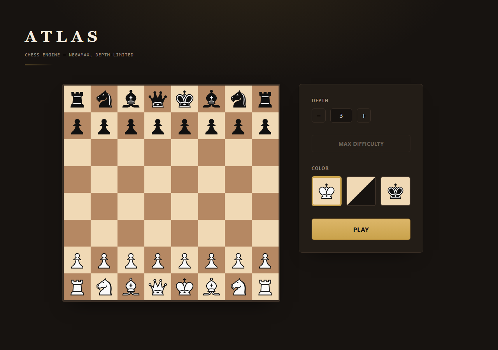

# Atlas

Atlas is a chess engine that I built from scratch in Rust, together with a small web app so
anyone can actually play against it in a browser instead of only reading about it in a
repository. I started this project mostly to get a real, hands on understanding of how
chess engines work under the hood: bitboards, move generation, search, evaluation, all of
it, rather than just importing a library and calling it a day.



## Play against it

The engine is deployed and playable right now at
[atlas-chessbot.duckdns.org](https://atlas-chessbot.duckdns.org/). You can pick a side, set
a search depth from 1 to 6, or turn on max difficulty if you want the bot to think for a few
seconds instead of stopping at a fixed depth.

The full architecture documentation, written following the arc42 template, lives at
[mvtrapiella.github.io/ChessBot](https://mvtrapiella.github.io/ChessBot/). It goes into
detail about the search algorithm, the evaluation function, the deployment setup and the
reasoning behind most of the decisions I made along the way.

## What it actually does

* Plays a full legal game of chess, checking for checkmate, stalemate, the fifty move rule,
  insufficient material and threefold repetition.
* Searches with negamax and alpha beta pruning, plus a quiescence search so it does not get
  fooled by a capture sequence that is still unfolding.
* Keeps a transposition table and orders moves using the table's own best move, capture
  values, killer moves and a history heuristic, so the search explores the promising lines
  first instead of wasting time on the rest.
* Opens with a real Polyglot format opening book built from grandmaster games, so the first
  moves of a game come from actual theory instead of the engine reinventing chess every
  single time.
* Runs entirely without a database. Each game lives in memory for as long as the server
  process is alive, which is more than enough for a project like this one.

## Built with

Rust for the engine and the API (using Axum), and React with TypeScript and Vite for the
frontend. The whole thing is containerized with Docker and deployed through GitHub Actions
to a small virtual machine, with nginx handling HTTPS through Let's Encrypt.

## Running it yourself

You will need a recent Rust toolchain and Node.js installed.

To just play with the engine from a terminal:

```
cargo run -p board_backend
```

To run the API on its own:

```
cargo run -p web_server
```

And to run the frontend against it (in a separate terminal, from the `webapp` folder):

```
npm install
npm run dev
```

If you would rather run the whole stack at once with Docker, from the repository root:

```
docker compose up --build
```

## How the repository is organized

The Rust side lives under `game_engine` as a Cargo workspace with three crates.
`board_backend` is the engine itself and has no external dependencies at all, `web_server`
is the Axum API that wraps it, and `magic_numbers` is a small offline tool used once to find
the magic numbers behind the engine's sliding piece move generation. The frontend lives in
`webapp`, and the source for the architecture documentation site lives in `docs`.

## A quick note on the name

I called the engine and the site Atlas mostly because it sounded fitting for something meant
to carry a game on its shoulders one move at a time. There is no deeper story than that.

## License

This project is released under the MIT license. Check the `LICENSE` file for the full text.

## Contact

Feel free to reach out if you have questions about the project or just want to talk chess
engines.

[LinkedIn](https://www.linkedin.com/in/matiasvalletrapiella/) · mvtrapiella@gmail.com
